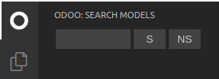

# A plugin for Odoo devs

## Installation

Build the package (`npm build` in the same folder with `package.json`) and put it into your extension folder (by default `~/.vscode/extensions/`).

## Features

### Search for models

- You should write Odoo addons paths to `vscode-odoo.addons_path` setting var.
- **S** and **NS** mean strict and non-strict search mode respectively.

